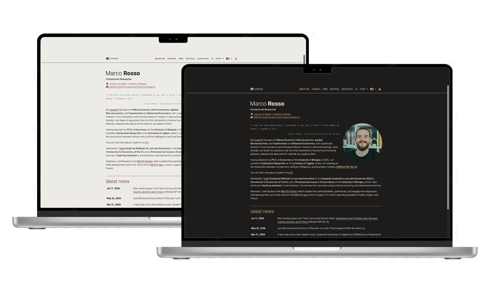

# marcorosso.com

  

Source of [marcorosso.com](https://marcorosso.com), the academic website of Marco Rosso, in English, Italian and Spanish.

Built with [Jekyll](https://jekyllrb.com/) on a heavily modified [al-folio](https://github.com/alshedivat/al-folio) /
[multi-language-al-folio](https://github.com/george-gca/multi-language-al-folio) theme, with
[jekyll-polyglot](https://github.com/untra/polyglot) for the three languages.

## Where the content lives

Most pages are generated from data files: the structure and the data that do not change with the language are in
`_data/<page>.yml`, the translated texts in `_data/<lang>/<page>_text.yml` (the different name is deliberate:
polyglot would merge a file with the same name). Each data file starts with a comment that explains its fields.

| Page                         | Data                                                         |
| ---------------------------- | ------------------------------------------------------------ |
| research                     | `_data/research.yml`, `_data/<lang>/research_text.yml`       |
| talks                        | `_data/talks.yml`, `_data/<lang>/talks_text.yml`             |
| teaching, materials          | `_data/teaching.yml`, `_data/<lang>/teaching_text.yml`       |
| course pages (materials)     | `_data/courses.yml`, `_data/<lang>/courses_text.yml`         |
| supervision                  | `_data/supervision.yml`, `_data/<lang>/supervision_text.yml` |
| references                   | `_data/references.yml`, `_data/<lang>/references_text.yml`   |
| CV                           | `_data/<lang>/cv.yml`                                        |
| people (coauthors, referees) | `_data/people.yml`                                           |
| news                         | `_news/<lang>/*.md`                                          |
| about, contacts              | `_pages/<lang>/about.md`, `_pages/<lang>/contacts.md`        |
| URLs across languages        | `_data/url_map.yml` (language switch and `hreflang` tags)    |

## Build and checks

- **Deploy**: every push to `master` builds the site with GitHub Actions and publishes it on the `gh-pages` branch.
- **Preview**: a push to a `refactor/**` branch builds the site and publishes it on the `preview` branch (not served),
  with a W3C validator report and a heading check in `_report/`.
- **Links**: after every deploy and every Monday, a link check on the published site; the report goes to an issue.
- **Formatting**: Prettier (`npx prettier . --check`), also run by a GitHub Action.
- **JavaScript**: files in `assets/js` must stay readable by the minifier (uglify-es): `node .husky/check-js.mjs`.

## License

The theme is released under the [MIT License](LICENSE), inherited from al-folio. The content of the site (texts,
papers, teaching materials, images) belongs to Marco Rosso.
